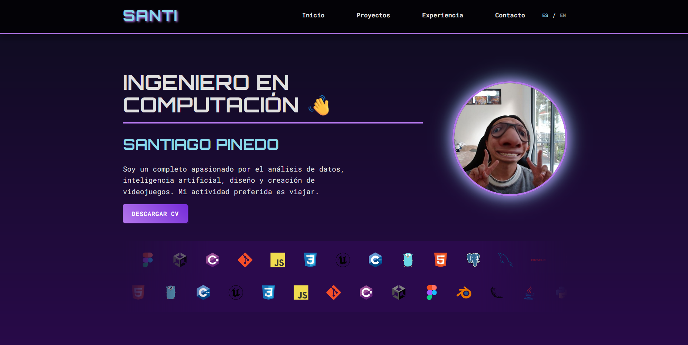

#  Portafolio Profesional de Santiago Pinedo 🚀

¡Bienvenido a mi portafolio! Este es un sitio web de una sola página, dinámico y totalmente responsivo, construido con Flask y Python para mostrar mis proyectos, habilidades y experiencia como Ingeniero en Computación.



---

## ✨ Características Principales

-   **Single-Page Application (SPA):** Toda la experiencia de navegación ocurre en una sola página con scroll suave.
-   **Diseño Totalmente Responsivo:** Perfectamente adaptable a dispositivos de escritorio, tabletas y móviles.
-   **Internacionalización (i18n):** Soporte completo para Español e Inglés, con un sistema de traducción dinámico basado en JSON y JavaScript.
-   **Componentes Interactivos:**
    -   Carrusel de habilidades infinito y bi-direccional.
    -   Galería de proyectos con modales para ver detalles.
    -   Sección de experiencia laboral en formato de carrusel horizontal.
-   **Animaciones Modernas:** Elementos que aparecen suavemente al hacer scroll, implementado con la API `IntersectionObserver` para un rendimiento óptimo.
-   **Arquitectura Limpia:**
    -   **Backend con Flask:** Sirve la página y una API de datos.
    -   **Frontend Dinámico:** El contenido se carga desde un único archivo `data.json`, permitiendo actualizaciones fáciles sin tocar el código principal.
    -   **Código Organizado:** Estructura de proyecto clara con separación de responsabilidades (lógica, plantillas, archivos estáticos, datos).

---

## ⚙️ Tecnologías Utilizadas

-   **Backend:** Python, Flask
-   **Frontend:** HTML5, CSS3 (con Flexbox y Grid), JavaScript (Moderno, ES6+)
-   **Motor de Plantillas:** Jinja2
-   **Gestión de Datos:** JSON
-   **Control de Versiones:** Git, GitHub

---

## 🚀 Instalación y Uso Local

Para clonar y correr este proyecto en tu máquina local, sigue estos pasos:

1.  **Clona el repositorio:**
    ```bash
    git clone [https://github.com/SantiagoRPinedo/Portfolio.git](https://github.com/SantiagoRPinedo/Portfolio.git)
    ```

2.  **Navega al directorio del proyecto:**
    ```bash
    cd TU_REPOSITORIO
    ```

3.  **Crea un entorno virtual:**
    ```bash
    python -m venv venv
    ```

4.  **Activa el entorno virtual:**
    -   **En Windows:**
        ```bash
        .\venv\Scripts\activate
        ```
    -   **En macOS/Linux:**
        ```bash
        source venv/bin/activate
        ```

5.  **Instala las dependencias:**
    ```bash
    pip install -r requirements.txt
    ```

6.  **Ejecuta la aplicación:**
    ```bash
    flask run
    ```
    O también:
    ```bash
    python app.py
    ```

7.  Abre tu navegador y ve a `http://127.0.0.1:5000`

---

## 📁 Estructura del Proyecto

La organización del código sigue las mejores prácticas para una aplicación Flask, separando la lógica, las plantillas y los archivos estáticos.

```bash
mi_portafolio/
├── .gitignore
├── app.py
├── data.json
├── requirements.txt
└── static/
│   ├── css/
│   │   └── style.css
│   ├── icons/
│   │   ├── python.svg
│   │   └── ... (más iconos)
│   ├── images/
│   │   ├── profile5.jpg
│   │   └── ... (más imágenes)
│   └── js/
│       └── main.js
└── templates/
├── index.html
└── layout.html
```

---

Hecho con ❤️ por Santiago Pinedo.